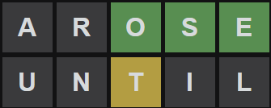

# Wordle Solver #

### Prerequisites ###
* None

### Development Environment Requirements ###
* [Visual Studio 2019](https://visualstudio.microsoft.com/thank-you-downloading-visual-studio/?sku=Community&rel=16&rid=30015)

### Sample Usage ###
I pretty much always use "arose" and "until" as my first 2 words. It covers the 9 most commonly used letters, and 10 of the top 11. It was particularly useful on Wordle 227:

After those 2 guesses, I fired up this solver.

    Enter what  you know (use ? for unknown letters):
    ??ose
    Enter unmatched letters:
    t
    Enter letters known to not be in the word
    aruiln
    Matches:
    those
